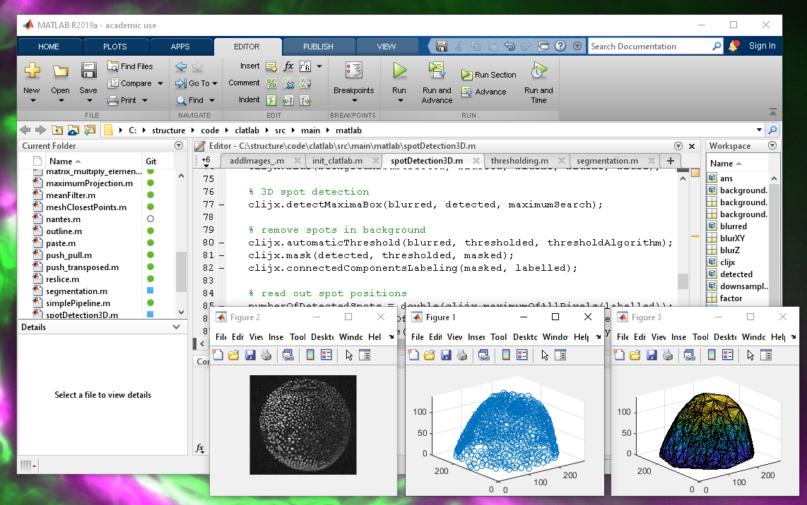

# clatlab
 
clatlab is a bridge between [Matlab](https://de.mathworks.com/products/matlab.html) and [clij](https://clij.github.io/).



Right now, this is very preliminary.

## Installation
Download the following files, removed the numbers from their file endings and put them all in a folder:
* [clatlab-0.4.0.jar](https://github.com/clij/clatlab/releases/download/0.4.0/clatlab-0.4.0.jar)
* [bridj-0.7.0.jar](https://sites.imagej.net/clij/jars/bridj-0.7.0.jar-20181201213334)
* [clij_1.4.0.jar](https://github.com/clij/clij/releases/download/1.4.0/clij_-1.4.0.jar)
* [clij-clearcl-0.10.0.jar](https://github.com/clij/clij/releases/download/1.4.0/clij-clearcl-0.10.0.jar)
* [clij-core-1.4.0.jar](https://github.com/clij/clij/releases/download/1.4.0/clij-core-1.4.0.jar)
* [clij-coremem-0.6.0.jar](https://github.com/clij/clij/releases/download/1.4.0/clij-coremem-0.6.0.jar)
* [clij-legacy_-0.1.0.jar](https://github.com/clij/clij-legacy/releases/download/0.1.0/clij-legacy_-0.1.0.jar)
* [imagej-common-0.28.2.jar](https://sites.imagej.net/Java-8/jars/imagej-common-0.28.2.jar-20190516211613)
* [imglib2-5.6.3.jar](https://sites.imagej.net/Java-8/jars/imglib2-5.6.3.jar-20181204141527)
* [imglib2-realtransform-2.1.0.jar](https://sites.imagej.net/Java-8/jars/imglib2-realtransform-2.1.0.jar-20181204141527)
* [jocl-2.0.1.jar](https://sites.imagej.net/clij/jars/jocl-2.0.1.jar-20181201212910)
* [scijava-common-2.77.0.jar](https://sites.imagej.net/Java-8/jars/scijava-common-2.76.1.jar-20181204141527)
* [ij-1.52p.jar](https://sites.imagej.net/Java-8/jars/ij-1.52p.jar-20190701230425)
* [imglib2-ij-2.0.0-beta-44.jar](https://sites.imagej.net/Java-8/jars/imglib2-ij-2.0.0-beta-44.jar-20181204141527)
* [clij-advanced-filters_-0.11.0.jar](https://github.com/clij/clij-advanced-filters/releases/download/0.11.0/clij-advanced-filters_-0.11.0.jar)

In your matlab script, specify _every_ individual jar file in this folder using `javaaddpath('folder/jarfile.jar'). 
It is recommended to do this in a utility function as [demonstrated here](https://github.com/clij/clatlab/blob/master/src/main/matlab/init_clatlab.m).

## Example code
Examples are available in the [matlab](https://github.com/clij/clatlab/blob/master/src/main/matlab/) folder. 
 
Clatlab provides two entry points for processing:
* `clx.op` is the entry point to clijs image processing operations. Read the [clij reference](https://clij.github.io/clij-docs/referenceJython) to see which operations are available. Replace `clij.op().` with `clx.op` in order to make it run in matlab. For example a Gaussian blur can be applied like this:

```
clx.op.blur(imageIn, imageOut, Float(5), Float(5));
```

* `clx.mocl` contains functionality which is accessible in a matlab way, but they are running using clij and OpenCL on the GPU. You can replace matlab code by mocl code:

```matlab
% matlab code:
a = ones(10, 1) * 6 + 8;
b = ones(10, 1) * 67 + 6;
c = a + b

% mocl alternative:
A = mocl.ones(10, 1) * 6 + 8;
B = mocl.ones(10, 1) * 67 + 6;
C = A + B;
c = mocl.pull(C);
```


### MOCL Commands
Following MOCL commands are implemented. Some are not fully tested yet. Work in progress.

| Command         | Matlab expresson     | mocl expression      | clij/clatlab counter part                       |
| --------------- | -------------------- | -------------------- | ----------------------------------------------- |
| push(a)         |                      | c = mocl.push(a)     | c = clij.push(a);                               |
| pull(a)         |                      | c = mocl.pull(a)     | c = clij.pull(a);                               |
| plus(a,b)       | c = a + b            | c = a + b            | clij.op().addImages(a, b, c);                   |
| minus(a,b)      | c = a - b            | c = a - b            | clij.op().subtractImages(a, b, c);              |
| uminus(a)       | c = -a               | c = -a               | clij.op().invert(a, c);                         |
| transpose(a)    | c = a.'              | c = a.'              | clijx.op.transposeXY(a, c);                     |
| times(a,b)      | c = a .* b           | c = a .* b           | clij.op().multiplyImages(a, b, c);              |
| mtimes(a,b)     | c = a * b            | c = a * b            | clijx.op.multiplyMatrix(a, b, c);               |
| rdivide(a,b)    | c = a ./ b           | c = a ./ b           | clij.op().divideImages(a, b, c);                |
| ldivide(a,b)    | c = b ./ b           | c = b ./ b           | clij.op().divideImages(b, a, c);                |
| power(a,b)      | c = a .^ b           | c = a .^ b           | clijx.op.powerImages(a, b, c);                  |
| lt(a,b)         | c = a < b            | c = a < b            | clijx.op.smaller(a, b, c);                      |
| gt(a,b)         | c = a > b            | c = a > b            | clijx.op.greater(a, b, c);                      |
| le(a,b)         | c = a <= b           | c = a <= b           | clijx.op.smallerOrEqual(a, b, c);               |
| ge(a,b)         | c = a >= b           | c = a >= b           | clijx.op.greaterOrEqual(a, b, c);               |
| ne(a,b)         | c = a ~= b           | c = a ~= b           | clijx.op.notEqual(a, b, c);                     |
| eq(a,b)         | c = a == b           | c = a == b           | clijx.op.equal(a, b, c);                        |
| and(a,b)        | c = a & b            | c = a & b            | clij.op().binaryAnd(a, b, c);                   |
| or(a,b)         | c = a &#x49; b            | c = a &#x49; b            | clij.op().binaryOr(a, b, c);                    |
| not(a)          | c = ~b               | c = ~b               | clij.op().binaryNot(a, c);                      |
| imhist(a)       | [c,x] = imhist(a)    | c = mocl.imhist(a)   | clij.op().fillHistogram(a, c);                  |
| fliplr(a)       | c = fliplr(a)        | c = mocl.fliplr(a)   | clij.op().flip(a, c, true, false, false);       |
| imRead(a)       | c = imread(a)        | c = imread(a)        |                                                 |
| min(a)          | c = min(a)           | c = mocl.min(a)      | c = clij.op().minimumOfAllPixels(a);            |
| max(a)          | c = max(a)           | c = mocl.max(a)      | c = clij.op().maximumOfAllPixels(a);            |
| mean(a)         | c = mean(a)          | c = mocl.mean(a)     | c = clij.op().meanOfAllPixels(a);               |
| ones(a)         | c = ones(a)          | c = mocl.ones(a)     |                                                 |
| zeros(a)        | c = zeros(a)         | c = mocl.zeros(a)    |                                                 |
| size(a)         | c = size(a)          | c = mocl.size(a)     |                                                 |
| colon(a,b)      | c = [a:b]            | c = mocl.colon(a,b)  |                                                 |

## How to develop clatlab
Clone this repository and build it using maven. Afterwards, you find the `clatlab.jar` in the `target` directory. 
Copy it to your clatlab/matlab java classpath.

```bash
git clone https://github.com/clij/clatlab
cd clatlab
mvn package
cp target/clatlab*.jar classpath/
```


## Please note
It is recommended to [use clij from Fiji](https://clij.github.io/clij-docs/installationInFiji). 
Matlab support is under development.

[Back to CLIJ documentation](https://clij.github.io/)
